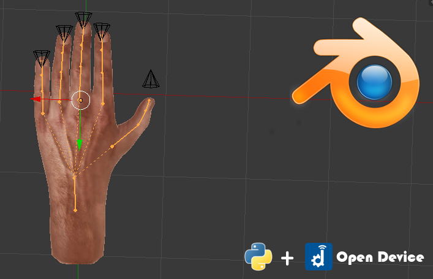

opendevice-3d-blender
==========================

Sample application illustrating the integration between [OpenDevice](http://opendevice.io) and Blender  

Dependencies: 

- Blender ( [install blender on linux](http://tipsonubuntu.com/2015/04/03/install-blender-2-74-ubuntu-14-04linux-mint-17) )
- Java 6 (or higher)
- Maven  

Getting Started

  1. Install OpenDevice Python library:

    - Clone: https://github.com/OpenDevice/opendevice-extensions

    - Follow the instructions (Basically clone and install like any other library python) 

  2. Clone this repo into a new directory.

  3. Compile: 
  
    - You can use pre-compiled version (opendevice-3d-blender-app.jar) or compile following the instructions:
    
    - Run on terminal `./run.sh` or `mvn package`,  it will compile and run the project
    
    - If not execute, check the ./target folder if the file exists: `opendevice-3d-blender-app.jar`
    
  4. Run OpenDevice (GUI): 

    - Run `./run.sh` or `java -jar opendevice-3d-blender-app.jar`

  5. Open Blender and import project: `./opendevice-3d-blender/assets/OpenDeviceHand.blend` 

  6. On Blender, change the 'lib_path' variable in script 'HandsConn.py'

  7. Put in Game Engine view and click in 'Start Game Engine': 
    
    - Changes on sliders in OpenDevice (GUI) must change the fingers (TIP: check console logs)

Videos
---------------
* [OpenDevice Python Client - Performance Test](https://www.youtube.com/watch?v=1h6N7G7cNpU ) 
* [OpenDevice + Blender - Controlling Bones (from Java)](https://youtu.be/UzPGMdgCZIE)
* [OpenDevice + Arduino + Blender](https://youtu.be/b3PbOPIMHmY)